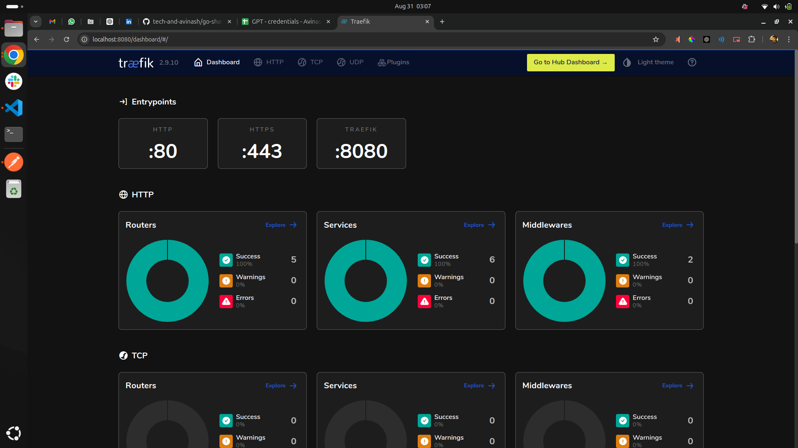

# Go Shared Microservices POC

A proof of concept (POC) for an event booking platform utilizing Golang, gRPC, and a gRPC REST Gateway. The platform is containerized using Docker and deployed using Docker Swarm, with Traefik serving as a reverse proxy.

## Event Booking Platform

This repository showcases a scalable event booking platform built with modern microservices architecture. It leverages Go for the core services, gRPC for internal communication, and Traefik as a gateway for managing traffic.

## Repository Structure

- **`api/`**: Protobuf definitions and generated gRPC code.
- **`cmd/`**: Entry points for the microservices.
- **`internal/`**: Contains service-specific logic and shared application components.
- **`deployments/`**: Docker and Swarm configuration files for deployment.
- **`pkg/`**: Reusable packages, utilities, and clients.
- **`scripts/`**: Utility scripts for tasks such as building, deploying, and code generation.
- **`Makefile`**: Simplifies common tasks like building, running, and deploying the platform.

## Overview

This POC demonstrates the following:

- **Golang and gRPC**: Core services implemented in Go using gRPC for efficient, type-safe communication.
- **gRPC REST Gateway**: Provides RESTful endpoints for external clients while keeping internal communications in gRPC.
- **Docker & Docker Swarm**: Containerized deployment with orchestration using Docker Swarm.
- **Traefik**: A dynamic reverse proxy for handling and routing incoming requests.

## Visuals

### Traefik Dashboard



### API Documentation

For detailed API documentation, visit the Postman link below:

[View the API Documentation](https://documenter.getpostman.com/view/10235256/2sAXjKbYhR)

You can also explore the complete Postman collection used in this project:

[View the full Postman collection](./go-shared-ms-poc.postman_collection.json)

## Setup Instructions

1. **Build Services**
   
   Build the services using the provided Makefile:

   ```sh
   make build
   ```

2. **Run Locally**
   
   Start the services on your local machine:

   ```sh
   make run
   ```

3. **Deploy to Swarm**
   
   Deploy the platform to Docker Swarm:

   ```sh
   make deploy
   ```

4. **Clean Up**

   Clean up the built artifacts and containers:

   ```sh
   make clean
   ```

## References

- [Source chatGPT](https://chatgpt.com/c/57ce70e8-3ba9-4bbd-9cbb-e4c0a1e0e0fd)
- [Shared chatGPT](https://chatgpt.com/share/0156f3b6-afa5-43b8-a1b0-729fd4c707f9)

## License

This project is licensed under the MIT License. See the [LICENSE](./LICENSE) file for more details.
